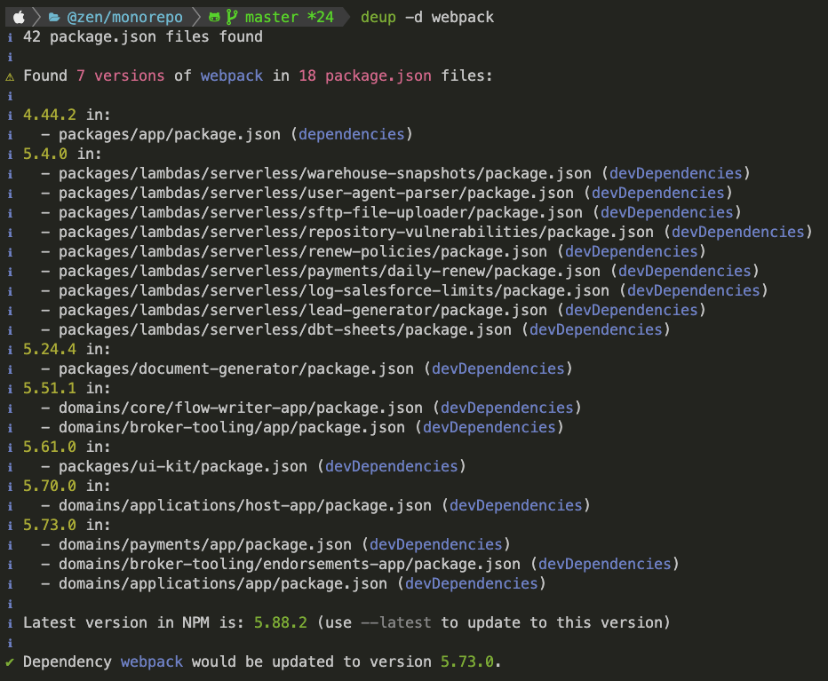

# DEUP

Deup is an utility package to support deduplicating dependencies in a monorepo.

## Installation

```
npm i -g deup
```

## Usage

```
deup [options] <packageName>[@<version>]
```

## Options

| Option | Description |
| --- | --- |
| `-d, --dry-run` | Dry run |
| `-l, --latest` | Update to the latest version |
| `-h, --help` | display help for command |
| `-V, --version` | output the version number |

## Example output


